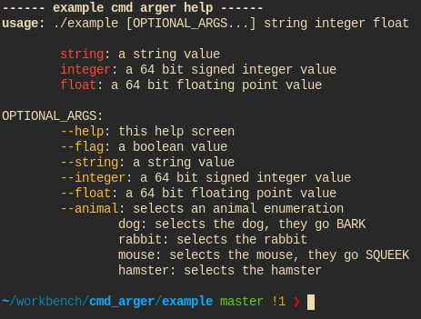

# Cmd Arger
A minimal command line argument parsing library.

Features:
- Simple easy to use API.
- No dependancies other than libc.
- Linux & Windows support (only tested on clang right now, let me know otherwise!).
- C99 compatible.
- Parse boolean, integers, floats, enums and strings with error checking.
- Auto generates a help message when parsing fails and can be invoked manually with --help
- Unix style optional arguments
- Optional arguments are allowed to be before, after and inbetween required arguments.
- Terminal colors

Non Features:
- Short hand optional arguments (with a single hyphen: tar -xvf): As you cannot clearly read what they mean.

# Usage:

Everywhere you need to use this library, put this at the top of the file:
```
#include "cmd_arger.h"
```

In a single compilation unit, include the source file.
```
#include "cmd_arger.c"
```

There is documentation inline in the **cmd_arger.h** file. Otherwise, the **example** directory has two examples to look at.

# Screenshots:

Auto-generated help message: access via --help or when parsing fails<br/>


